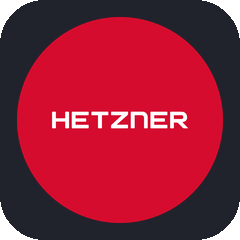

  

  

⭐ From <a href="https://github.com/chrishuan9?tab=repositories">@chrishuan9</a> — thanks for stopping by!

---

### 🇦🇺 About Me

- ⚙️ Platform engineer focused on **Linux automation, infrastructure lifecycle, and cloud-native platforms**
- 🏢 Technical Account Manager for Platform and Ansible at **Red Hat** by day, Automation/Infrastructure Engineer by night 🌙
- 🛠️ Designing automated Linux server services and helping shape Container-as-a-Service platforms
- 📦 Package maintainer at heart — I like keeping systems reproducible and boring (in a good way)

🇨🇳 关于我 (About Me — Mandarin)

- ⚙️ 专注于 Linux 自动化、基础设施生命周期管理和云原生平台的平台工程师
- 🏢 白天是红帽（Red Hat）平台与 Ansible 技术客户经理，晚上是自动化/基础设施工程师 🌙
- 🛠️ 设计自动化 Linux 服务器服务，并参与打造容器即服务（Container-as-a-Service）平台
- 📦 骨子里是个包维护者 —— 喜欢让系统保持可复现、"无聊"（也就是稳定可靠，这是件好事）

### 🛠️ Tech Stack

  
  
  
  
  
  
  
  
  
  
  
  
  

  
  
  
  
  

### 🤝 Let's Connect

  
  
  
  

<em>Thanks for stopping by — feel free to explore my pinned repos below ⬇️</em>

